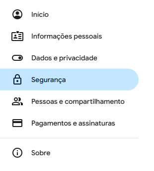
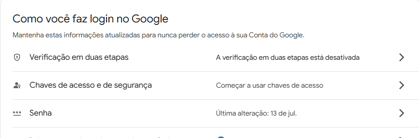
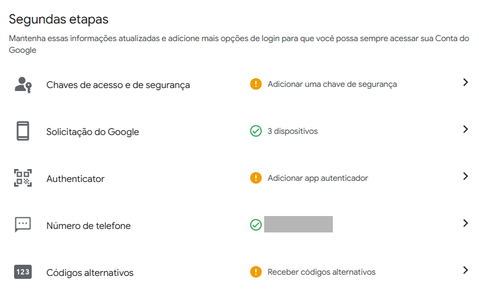
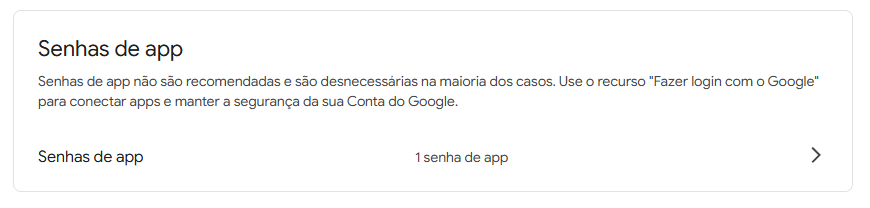

# Aplicação com jornadas

Este projeto é uma solução para automatizar o disparo de jornadas personalizadas para colaboradores, garantindo que ações definidas (como envio de e-mails e agendamento de tarefas) sejam executadas no momento certo e sem intervenção manual.

## Pontos de Avaliação Atendidos

-   **Definição dos modelos/schemas:** Os modelos para `User` (Colaborador), `Event` e `Task` foram definidos utilizando Mongoose, representando claramente as entidades do sistema.
-   **Operações em segundo plano:** Funcionalidades como criação de `usuário`, criação de `evento` e agendamento de `tarefas` preparam uma `jornada` de uma ou mais `ações`.
-   **Organização do projeto:** A aplicação é dividida em `backend` e `frontend`, com uma arquitetura clara e modular em cada parte (Controllers, Services, Repositories, etc.), facilitando a manutenção e escalabilidade.
-   **Clareza do código:** O código é bem estruturado, utilizando padrões de projeto para separação de responsabilidades.
-   **Testes unitários:** Foram implementados testes unitários para as funcionalidades críticas do backend (criação de usuários, eventos e tarefas) utilizando Jest.
-   **Documentação técnica:** Este `README.md` serve como a documentação central do projeto.

---

## Arquitetura e Tecnologias

A aplicação utiliza uma arquitetura de microsserviços orquestrada com Docker Compose.

-   **Backend**:
    -   **Framework**: Node.js com Express.js
    -   **Banco de Dados**: MongoDB com Mongoose para modelagem de dados.
    -   **Filas e Jobs em Background**: Redis com Bull.js para processamento assíncrono de e-mails e tarefas.
    -   **Autenticação**: JWT (JSON Web Tokens).
    -   **Validação**: Joi para validação de schemas de entrada.
    -   **E-mails**: Nodemailer.
    -   **Testes**: Jest.

-   **Frontend**:
    -   **Framework**: React com Vite.
    -   **Linguagem**: TypeScript.
    -   **Estilização**: Tailwind CSS.
    -   **Comunicação com API**: Axios.

-   **Containerização**:
    -   Docker e Docker Compose para orquestrar os serviços de backend, frontend, MongoDB e Redis.

---

## Modelos de Dados (Schemas)

### 1. User
Representa um colaborador no sistema.

<!-- path: backend/database/schema/models.js -->
User Schema:
- **name**: String, obrigatório
- **email**: String, obrigatório, único
- **password**: String, obrigatório
- **tasks**: Lista de referências para Task

### 2. Invitation
O convite representa a participação de um usuário em um evento. No schema, cada participante de um evento é um subdocumento do tipo Invitation, contendo:

<!-- path: backend/database/schema/models.js -->
Invite Schema:
- **user**: Referência para User, obrigatório
- **status**: String, obrigatório, valores possíveis: 'invited', 'accepted', 'declined' (padrão: 'invited')

### 3. Event
Representa uma jornada, que é uma sequência de ações. A ação inicial é o envio de um convite por e-mail em uma data agendada.

<!-- path: backend/database/schema/models.js -->
Event Schema:
- **title**: String, obrigatório
- **description**: String, obrigatório
- **location**: String, obrigatório
- **date**: Date, obrigatório
- **sendInvitesAt**: Date, obrigatório
- **createdBy**: Referência para User, obrigatório
- **inviteMessage**: String, obrigatório
- **participants**: Lista de referência para Invitation

### 4. Task
Representa uma jornada que pode ser agendada para um colaborador.

<!-- path: backend/database/schema/models.js -->
Task Schema:
- **user**: Referência para User, obrigatório
- **description**: String, obrigatório
- **status**: String, obrigatório, valores possíveis: 'pending', 'completed' (padrão: 'pending')
- **assignAt**: Date, obrigatório (data de execução da jornada)

---

## Arquitetura da Aplicação

A aplicação segue uma **arquitetura em camadas** no backend, com separação clara de responsabilidades, e utiliza containers Docker para facilitar o deploy e o isolamento dos serviços. Não se trata de uma arquitetura de microsserviços, pois toda a lógica de negócio está centralizada em um único backend, que expõe uma API REST consumida pelo frontend.

### Camadas do Backend

- **Controllers**: Recebem e tratam as requisições HTTP, delegando a lógica para os services.
- **Services**: Implementam o funcionamento em background e orquestram as operações para autenticação.
- **Repositories**: Responsáveis pelo acesso e manipulação dos dados no banco (MongoDB).
- **Middlewares**: Tratam autenticação, validação e outras funções transversais.
- **Filas (Bull/Redis)**: Gerenciam tarefas assíncronas, como envio de e-mails e agendamento de tarefas.

### Frontend

- Desenvolvido em React, consome a API REST do backend para autenticação, cadastro de usuários, criação de eventos, tarefas e visualização dos dados.

### Orquestração com Docker Compose

- Cada serviço (backend, frontend, MongoDB, Redis) roda em seu próprio container, facilitando o desenvolvimento, testes e deploy.

---

## Jornadas

A aplicação permite automatizar diferentes tipos de jornadas para os colaboradores, tornando o fluxo de comunicação e atribuição de tarefas mais eficiente:

- **Cadastro de usuário:** Ao se cadastrar, o colaborador recebe automaticamente um e-mail de boas-vindas após um minuto, sem necessidade de intervenção manual.
- **Criação de evento:** Ao criar um evento, é possível agendar o envio dos convites por e-mail para os participantes em uma data e hora específicas, garantindo que todos sejam notificados no momento certo.
- **Agendamento de tarefa:** Ao agendar uma tarefa, o sistema permite definir quando a atividade será atribuída ao colaborador. No momento estabelecido, o objeto da tarefa é criado no banco de dados e um e-mail de notificação é enviado automaticamente ao responsável.

Esses fluxos são processados de forma assíncrona, utilizando filas para garantir que as ações ocorram nos horários programados, mesmo que haja grande volume de operações.

## Fluxo da Aplicação

1. **Autenticação**:  
   O usuário acessa o frontend e realiza login ou cadastro. O frontend envia as credenciais para o backend, que valida e retorna um token JWT.

2. **Criação de Jornadas (Eventos/Tarefas)**:  
   Usuários autenticados podem criar eventos e tarefas. O frontend envia os dados para o backend, que valida, salva a informação no banco ou na memória do redis, agendando as ações necessárias (como envio de convites por e-mail ou atribuição de tarefas).

3. **Processamento Assíncrono**:  
   Ações agendadas (como envio de e-mails ou atribuição de tarefas) são processadas em background por meio de filas gerenciadas pelo Bull (usando Redis).

4. **Notificações e Atualizações**:  
   Quando chega o momento de executar uma ação agendada, o backend processa a fila e realiza a ação.

5. **Visualização e Gerenciamento**:  
   Usuários podem visualizar suas jornadas, tarefas e eventos pelo frontend, que consome os dados da API do backend.

> Esta arquitetura garante organização, escalabilidade e facilidade de manutenção, além de permitir o processamento eficiente de criação de eventos, tarefas agendadas e comunicação clara entre as partes do sistema.

---

## Como Executar Localmente

### Pré-requisitos
-   [Git](https://git-scm.com/downloads)
-   [Docker](https://www.docker.com/get-started)
-   [Docker Compose](https://docs.docker.com/compose/install/)
-   [MongoDB](https://www.mongodb.com/try/download/community)

### 1. Clonar o Repositório

```bash
git clone https://github.com/seu-usuario/journey-automation.git
cd journey-automation
```

### 2. Configurar Variáveis de Ambiente

Crie uma cópia do arquivo de exemplo `.env.example` na raiz do projeto e renomeie para `.env`.

Abra o arquivo `.env` e preencha as variáveis de configuração do Nodemailer (`GMAIL_USER` e `GMAIL_PASS`).

**Importante**: Para o `GMAIL_PASS`, você precisa gerar uma "Senha de App" na sua conta Google, não é a sua senha de login. Siga os seguintes passos:

1. Acesse a [página do seu perfil google](https://myaccount.google.com/)
2. Vá para aba de segurança na lista à esquerda  

3. Clique na opção de `Verificação em duas etapas`  

4. Cadastre duas opções de segunda etapa da verificação  

5. Clique na área liberada da opção de verificar suas `Senhas de app`  

6. O nome não é relevante para o funcionamento da senha, mas guarde a senha com muito cuidado


### 3. Iniciar a Aplicação

Com o Docker em execução, suba os contêineres com Docker Compose.

```bash
docker-compose up --build
```

A aplicação estará disponível nos seguintes endereços:
-   **Frontend**: `http://localhost:5173`
-   **Backend**: `http://localhost:3001`

---

## Como Executar os Testes Unitários

Os testes unitários do backend podem ser executados com a seguinte sequência de comandos:

```bash
cd backend
```

```bash
pnpm test
```